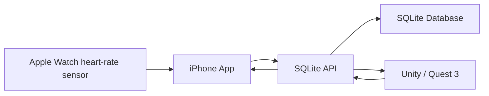

# VR Avatar HeartWatch Demo

This is a lightweight presentation demo for showing how **VR + Sensor + iPhone App + SQLite Database** connect.

Core flow:



## Four Parts

- **VR**: Unity + Quest 3 scene with an avatar, heart-rate panel, dialogue panel, start control, and exit control.
- **Sensor**: Apple Watch collects live heart rate through a HealthKit workout.
- **Application**: iPhone SwiftUI app bridges the Watch, shows charts, browses database rows, and displays VR records.
- **Database**: Express + SQLite local backend storing heart-rate samples, avatar messages, VR events, and dialogue rows.

The static web page is documentation only. The live dashboard is the iPhone app.

## One-file Start

macOS:

```bash
./scripts/start-demo-macos.command
```

Windows PowerShell:

```powershell
.\scripts\start-demo-windows.ps1
```

The launcher will:

1. Start the local SQLite API.
2. Print the computer LAN API URL, such as `http://192.168.1.20:8787`.
3. Open the built Unity app if it exists.
4. Open the Unity project if no built app exists yet.

## Copy To Windows

For a Windows presentation machine, copy the repo folder after dependencies have been installed, or clone the repo on Windows and run `npm install` once.

Minimum files and folders needed on Windows:

```text
apps/api
database
scripts/start-demo-windows.ps1
package.json
package-lock.json
release/Windows
```

Run from the repo root:

```powershell
.\scripts\start-demo-windows.ps1
```

Keep iPhone, Quest 3, and the Windows computer on the same Wi-Fi. In the iPhone app Settings tab, use the API URL printed by the Windows script, for example `http://WINDOWS_IP:8787`.

## Demo Controls

- Quest right-hand **B**: start the demo and write `demo_start`.
- Quest right-hand **A**: advance the current scripted dialogue.
- Quest left-hand **X**: start or replay the current script.
- Quest left-hand **Y**: switch scripts.
- Quest right-hand **Menu**: exit the VR app, write `demo_stop`, and stop live recording.
- Unity Editor keyboard: `B` starts, `N/Enter` advances, `X/Y` switches, `Q` exits.

## Main API Endpoints

- `GET /api/demo/status`
- `POST /api/demo/start`
- `POST /api/demo/stop`
- `POST /api/samples`
- `GET /api/latest`
- `GET /api/db/tables`
- `POST /api/chat/records`
- `GET /api/chat`

## Project Structure

```text
apps/api                 # Express + SQLite backend
apps/web                 # Static documentation site
database                 # SQLite schema
ios/HeartWatchDemo       # iPhone + Watch Xcode project
sensor/apple-watch       # iPhone/Apple Watch Swift code
unity/VRAvatarHeartWatch # Unity Quest 3 project
docs                     # Demo, deployment, and test docs
```

## Detailed Docs

- Full demo flow: `docs/demo-application.md`
- Windows release guide: `docs/windows-release.md`
- Runtime logs: `docs/processing-log.md`
- Interface map: `docs/interface-map.md`
- Short startup checklist: `docs/startup-test.md`
- iPhone/Watch installation: `docs/ios-application.md`
- Database schema: `docs/database-schema.md`
- Unity/Quest notes: `unity/VRAvatarHeartWatch/README.md`
