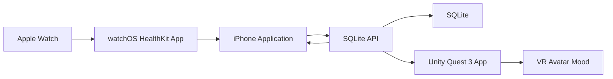

# VR Avatar Heart Watch Demo

Lightweight repo template for a Quest 3 Unity VR avatar that reacts to Apple Watch heart-rate data, records everything in SQLite, and exposes an installable iPhone app for live charts, records, VR events, and conversation logs.

## Four Parts

- **VR**: Unity + Quest 3 scripts in `unity/`, built to poll the latest heart-rate zone and update avatar mood.
- **Sensor**: Apple Watch HealthKit + WatchConnectivity app in `sensor/apple-watch/`, sending live heart-rate samples through iPhone to the API.
- **Application**: iPhone SwiftUI app in `sensor/apple-watch/`, with Watch bridge, live heart-rate chart, heart-rate records, VR events, and conversation records.
- **Database**: SQLite schema and local API in `apps/api/`.

The Web page in `apps/web/` is now a static project README for Vercel/GitHub Pages, not the live dashboard.

## Lightweight Architecture



## Project Structure

```text
.
├── apps
│   ├── api              # Express + SQLite local API
│   └── web              # Static project README site
├── database             # SQLite schema
├── ios
│   └── HeartWatchDemo   # Generated iPhone + watchOS Xcode project
├── sensor
│   └── apple-watch      # watchOS/iPhone bridge starter code
├── unity                # Unity Quest 3 scripts and setup notes
├── .github/workflows    # GitHub Pages deploy
├── vercel.json          # Vercel deploy config
└── docs
    ├── apple-watch-integration.md
    ├── database-schema.md
    ├── deployment.md
    ├── ios-application.md
    ├── project-completion.md
    └── demo-script.md
```

## Run The Static Web README

```bash
npm install
npm run web:dev
```

Open the local Vite URL. This site explains the project and setup flow; it does not fetch live data.

## Run With SQLite API

```bash
npm install
npm run api:dev
```

The API writes to `apps/api/data/demo.sqlite` and exposes:

- `POST /api/samples`
- `GET /api/samples`
- `GET /api/latest`
- `GET /api/events`
- `POST /api/chat/records`
- `GET /api/chat`

## Deploy

- **Vercel**: import this repo and use the included `vercel.json`.
- **GitHub Pages**: enable Pages from GitHub Actions; workflow is in `.github/workflows/pages.yml`.

The hosted Web page is static documentation for the project. The live application interface is the iPhone app.

## Unity + Quest 3

See `unity/README.md` and `docs/living-room-scene.md`. The current demo scene is:

```text
unity/VRAvatarHeartWatch/Assets/Scenes/Quest3LivingRoomAvatar.unity
```

The shortest Quest 3 path is:

1. Open Unity Hub.
2. Create a 3D URP project.
3. Install Android Build Support and XR Plugin Management.
4. Enable OpenXR for Android.
5. Import the licensed local assets: Robot Kyle, Meta XR/Building Blocks, and any scene assets you want.
6. Open or regenerate `Quest3LivingRoomAvatar.unity`.
7. Set `HeartRateReceiver.apiBaseUrl` and `ScriptedConversationController.apiBaseUrl` to your API URL.
8. Build and run to Quest 3.

For a Quest build, use your Mac LAN IP such as `http://192.168.1.20:8787`; do not use `127.0.0.1`, because that points to the Quest device itself.

## Apple Watch Heart-rate Stream

See `docs/ios-application.md`, `docs/apple-watch-integration.md`, and `sensor/apple-watch/README.md`. The live path is:

1. Open `ios/HeartWatchDemo/HeartWatchDemo.xcodeproj` in Xcode.
2. Start a workout session on Apple Watch to receive live heart-rate samples.
3. Send samples to the iPhone companion app through WatchConnectivity.
4. The iPhone app posts samples to `POST /api/samples`.
5. The iPhone app reads `/api/samples`, `/api/events`, and `/api/chat` for charts and records.

The included Swift files are split by target:

- Watch target: `WatchHeartRateApp.swift`, `WatchHeartRateView.swift`, `WatchHeartRateManager.swift`
- iPhone target: `iPhoneHeartRateBridgeApp.swift`, `iPhoneHeartRateBridgeView.swift`, `iPhoneWatchConnectivityBridge.swift`, `HeartWatchModels.swift`, `HeartWatchAPIClient.swift`

## What To Demo

1. Start the local SQLite API.
2. Install the iPhone + Watch app from Xcode.
3. Start the Apple Watch heart-rate stream.
4. Watch the iPhone app chart and records update.
5. Run Unity on Quest 3 and let the heart-rate panel follow the latest sample.
6. Use X/Y/A or keyboard X/Y/N to drive scripted dialogue and store conversation rows in SQLite.
7. Tap Sync in the iPhone app and inspect conversation records.

## Completion Notes

See `docs/project-completion.md` for the current implementation status, verification commands, and full Apple Watch to iPhone app to VR to SQLite operation steps.
