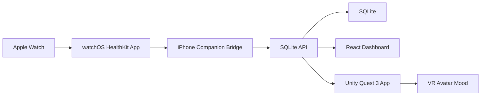

# VR Avatar Heart Watch Demo

Lightweight repo template for a Quest 3 Unity VR avatar that reacts to Apple Watch heart-rate data, records everything in SQLite, and exposes a React web dashboard deployable to Vercel and GitHub Pages.

## Four Parts

- **VR**: Unity + Quest 3 scripts in `unity/`, built to poll the latest heart-rate zone and update avatar mood.
- **Sensor**: Apple Watch HealthKit bridge skeleton in `sensor/apple-watch/`, sending live heart-rate samples through iPhone to the API.
- **Web Dashboard**: React + Vite app in `apps/web/`, with mock stream mode and API mode.
- **Database**: SQLite schema and local API in `apps/api/`.

## Lightweight Architecture



## Project Structure

```text
.
├── apps
│   ├── api              # Express + SQLite local API
│   └── web              # React + Vite dashboard
├── database             # SQLite schema
├── sensor
│   └── apple-watch      # watchOS/iPhone bridge starter code
├── unity                # Unity Quest 3 scripts and setup notes
├── .github/workflows    # GitHub Pages deploy
├── vercel.json          # Vercel deploy config
└── docs
    ├── apple-watch-integration.md
    ├── database-schema.md
    ├── deployment.md
    └── demo-script.md
```

## Run The React Dashboard

```bash
npm install
npm run web:dev
```

Open the local Vite URL.

## Run With SQLite API

```bash
npm install
npm run api:dev
npm run web:dev
```

The API writes to `apps/api/data/demo.sqlite` and exposes:

- `POST /api/samples`
- `GET /api/samples`
- `GET /api/latest`
- `GET /api/events`

## Deploy

- **Vercel**: import this repo and use the included `vercel.json`.
- **GitHub Pages**: enable Pages from GitHub Actions; workflow is in `.github/workflows/pages.yml`.

The hosted dashboard can run in mock mode by default. To use real Apple Watch data, deploy or run the SQLite API and set `VITE_API_BASE_URL`.

## Unity + Quest 3

See `unity/README.md`. The shortest path is:

1. Open Unity Hub.
2. Create a 3D URP project.
3. Install Android Build Support and XR Plugin Management.
4. Enable OpenXR for Android.
5. Import scripts from `unity/Assets/Scripts`.
6. Set `HeartRateReceiver.apiBaseUrl` to your API URL.
7. Build and run to Quest 3.

## Apple Watch Heart-rate Stream

See `docs/apple-watch-integration.md` and `sensor/apple-watch/README.md`. The live path is:

1. Build a watchOS app with HealthKit permission.
2. Start a workout session on Apple Watch to receive live heart-rate samples.
3. Send samples to the iPhone companion app through WatchConnectivity.
4. The iPhone app posts samples to `POST /api/samples`.

## What To Demo

1. Start the React dashboard in mock mode.
2. Start the local SQLite API.
3. Post mock or Apple Watch samples to the API.
4. Watch the dashboard update.
5. Run Unity on Quest 3 and let the avatar mood follow the latest heart-rate zone.
