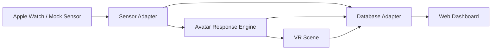

# VR Avatar Heart Watch Demo

A lightweight demo template for a VR avatar that responds to Apple Watch heart-rate signals, with a web dashboard and simple database layer for recorded sessions.

## Demo Goal

Build the smallest useful prototype with four visible parts:

- **VR**: a browser-based VR scene where a user can interact with an avatar.
- **Sensor**: an Apple Watch heart-rate source, mocked first and replaceable with HealthKit/watchOS later.
- **Web Dashboard**: a page that shows live heart rate, avatar responses, session events, and summaries.
- **Database**: a local storage adapter first, with an easy migration path to SQLite/Supabase/Firebase.

## Fastest Demo Plan

### Phase 1: Static Prototype

- Use plain HTML/CSS/JavaScript.
- Use A-Frame from CDN for the VR scene.
- Use a mock heart-rate stream to simulate Apple Watch data.
- Save heart-rate samples, avatar messages, and session events into `localStorage`.
- Show all records in a dashboard table and simple SVG chart.

### Phase 2: Real Sensor Bridge

- Build a small watchOS app that reads heart rate through HealthKit.
- Send samples to the web app through one of:
  - local WebSocket bridge during demo,
  - iPhone companion app,
  - cloud endpoint.
- Keep the web app input contract identical to the mock stream:

```json
{
  "source": "apple_watch",
  "heartRate": 92,
  "timestamp": "2026-06-07T13:30:00.000Z"
}
```

### Phase 3: Real Database

- Replace the `localStorage` database adapter with Supabase, Firebase, or SQLite.
- Preserve the same domain entities:
  - `heart_rate_samples`
  - `avatar_messages`
  - `vr_events`
  - `sessions`

### Phase 4: Rich VR Interaction

- Replace the placeholder avatar with a real 3D model.
- Add voice input/output.
- Add avatar emotion states based on heart-rate zones.
- Add session replay in the dashboard.

## Suggested Lightweight Architecture



## Project Structure

```text
.
├── index.html
├── styles.css
├── src
│   ├── app.js
│   ├── avatarEngine.js
│   ├── database.js
│   ├── dashboard.js
│   ├── sensorMock.js
│   └── vrScene.js
└── docs
    ├── apple-watch-integration.md
    ├── database-schema.md
    └── demo-script.md
```

## Run Locally

Open `index.html` in a browser.

For best results with WebXR/WebVR features, serve it locally:

```bash
npx serve .
```

Then open the local URL shown in the terminal.

## What To Demo

1. Start the mock Apple Watch stream.
2. Watch the avatar react to changing heart-rate zones.
3. Log VR interaction events such as focus, breathing prompt, and avatar check-in.
4. Review heart-rate samples and avatar messages in the dashboard.
5. Export the locally stored records as JSON.

